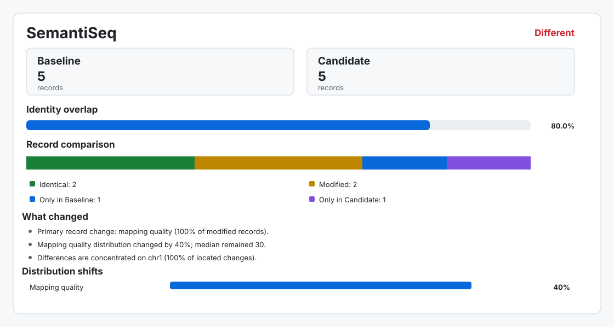

# GenDiff

Semantic comparison for genomics files.

GenDiff determines whether two files contain the same logical records, even when
record order, compression, or provenance metadata differ. It supports BAM/CRAM
and VCF/BCF.

```text
$ gendiff sample-a.merged.bam sample-b.merged.bam --explain
Equivalent: no
Type: alignment
Relationship: different datasets
Identity overlap: 0.0%
Inputs:
  Sample A: sample-a.merged.bam (9,398 records)
  Sample B: sample-b.merged.bam (147,213 records)
Logical records: different
Structural header: different
Metadata header: different (informational)
Record differences:
  Identical: 0
  Modified: 0
  Only in Sample A: 9,398
  Only in Sample B: 147,213
```



## Install

Python 3.9 or newer is required.

```bash
python -m pip install git+https://github.com/AlexanderM-M/gendiff.git
```

For local development:

```bash
git clone https://github.com/AlexanderM-M/gendiff.git
cd gendiff
python -m pip install -e '.[test]'
pytest
```

## Usage

```bash
gendiff OLD NEW
gendiff old.bam new.bam --explain
gendiff old.bam new.bam --profile mapping --ignore-tag MD
gendiff old.cram new.cram --reference reference.fa
gendiff old.vcf.gz new.bcf --normalize --reference reference.fa
gendiff old.bam new.bam --html comparison.html
gendiff old.bam new.bam --svg comparison.svg
gendiff old.bam new.bam --write-diff diff-records
gendiff old.bam new.bam --tracks genomic-tracks
gendiff old.bam new.bam --difference-table differences.tsv.gz
gendiff old.bam new.bam --region chr1:100000-200000
gendiff old.bam new.bam --regions targets.bed --exclude-regions blacklist.bed
gendiff old.bam new.bam --reference reference.fa --igv-batch differences.igv.batch
gendiff old.bam new.bam --threads 8 --progress
gendiff old.vcf.gz new.bcf --json
gendiff batch comparisons.tsv --html regression.html --junit regression.xml
gendiff manifest baseline-run candidate-run --output comparisons.tsv
```

Exit status is `0` when inputs are semantically equivalent, `1` when they differ,
and `2` when comparison cannot be completed. JSON output is intended for CI and
workflow integration.

GenDiff compares all logical record fields and the structural parts of each
header. Record ordering, file encoding, and non-structural header metadata do not
affect equivalence. The `strict`, `core`, `mapping`, `calls`, and `genotypes`
profiles provide progressively focused comparisons for their supported formats.
Input names are inferred from filenames and can be overridden with `--name-a` and
`--name-b`.

The default fingerprint pass uses bounded memory. `--explain` performs disk-backed
record matching and reports both changed fields and transitions such as MAPQ,
mapping status, flags, filters, and genotypes. Use `--temp-dir` to select scratch
storage. With indexed alignment files, both scanning and detailed matching are
divided by contig when more than two threads are requested.

Limit a comparison with repeatable `--region` values or a BED file passed to
`--regions`; `--exclude-regions` removes unwanted intervals. Coordinates passed
to `--region` are one-based and inclusive, while BED coordinates follow the BED
standard. `--difference-table` writes every modified or sample-only record as a
streamed TSV ledger; use a `.gz` suffix for compression.

`--write-diff DIR` writes four ordinary BAM or VCF files: records found only in
each input and the before/after versions of modified records. A small manifest
records the labels, comparison profile, filenames, and record counts. These files
can be passed directly to samtools, bcftools, IGV, or downstream workflows.

`--tracks DIR` writes affected loci, raw and normalized difference bedGraphs, a
log2 coverage-ratio bedGraph, and a per-contig TSV. These files work directly
with IGV, bedtools, and other genome browsers.

Reference-aware VCF normalization follows bcftools semantics and requires an
indexed FASTA. HTML reports are self-contained and lead with three concise
findings, a proportional record overview, significant distribution shifts, and
a normalized genome-wide difference and coverage map. A MAPQ or genotype
transition matrix appears when applicable; detailed tables stay collapsed. SVG
summaries can be used directly in documents and presentations. IGV output is a
batch file that loads both inputs and visits example changed loci.

## Pipeline regression

Batch mode compares multiple baseline and candidate outputs. The manifest is a
tab-separated file; row order defines pipeline-stage order for earliest-divergence
reporting.

```text
sample  stage       before                 after
Sample A alignment  baseline/A.bam         candidate/A.bam
Sample A variants   baseline/A.vcf.gz       candidate/A.vcf.gz
Sample B variants   baseline/B.vcf.gz       candidate/B.vcf.gz
```

```bash
gendiff batch comparisons.tsv \
  --threads 16 \
  --html regression.html \
  --json regression.json \
  --junit regression.xml \
  --multiqc gendiff_mqc.json \
  --write-diff differences
```

By default, modified records, records found in only one input, and structural
header differences fail a comparison. Controlled changes can be accepted with
`--max-modified`, `--max-only`, `--min-overlap`, and
`--allow-structural-differences`. `--fail-transition genotype`, for example,
continues to reject genotype transitions even when some modified records are
allowed. Optional manifest columns are `profile`, `reference`, and `normalize`;
relative paths are resolved from the manifest directory.

For stage-specific acceptance rules, pass a versioned JSON policy:

```bash
gendiff batch comparisons.tsv --policy examples/policy.json --json gendiff-batch.json
```

Rules can match sample, stage, file kind, and profile. They support absolute and
relative limits, allowed or forbidden changed fields and transitions, and
error, warning, or informational severity. Reports record the matched rule and
the decision trace. Unapproved transitions fail by default when a policy file is
used, and later matching rules override earlier settings.

To create the manifest from matching directory trees, use `gendiff manifest`.
It pairs relative paths exactly and stops if either tree has missing or ambiguous
files. Add `--dry-run` to inspect the TSV without writing it.

Compact baselines preserve semantic hashes and counts without storing read names,
loci, sequences, or whole input files:

```bash
gendiff baseline create comparisons.tsv --output pipeline-baseline.gendiff.json
gendiff baseline check pipeline-baseline.gendiff.json comparisons.tsv
```

Baseline checks detect changes to logical fields and structural headers. Keep the
original baseline files when record-level diff files or transition explanations
may be needed later.

The aggregate JSON is intended for automation, JUnit integrates with CI systems,
and filenames ending in `_mqc.json` are discovered by MultiQC as custom content.
Installing `gendiff[multiqc]` also provides a native MultiQC module; name the
aggregate JSON `gendiff-batch.json` so it is discovered automatically.

Some Linux distributions provide an unrelated `/usr/bin/gendiff`; install GenDiff
in a virtual environment or invoke it as `python -m gendiff`. GenDiff is not a
substitute for assay validation.

## License

MIT
